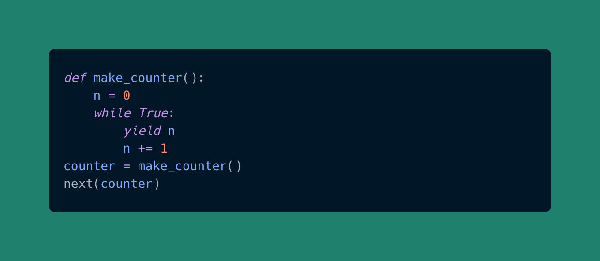

# assignment-2

<!--  carbon code -- can you guess what it does? Run and see the result!

-->

Python data model practices -- Callables.

You will be practicing python data types, user functions, built-in functions, classes, etc.

- User Functions

Best of luck :smile:.
